# flutter_ui_demos

A new Flutter project to demonstrate Flutter capabilities and UI. Open source project for learning and helping others learn.

Landing Page:
 

 
 
Login/Register Pages:
 

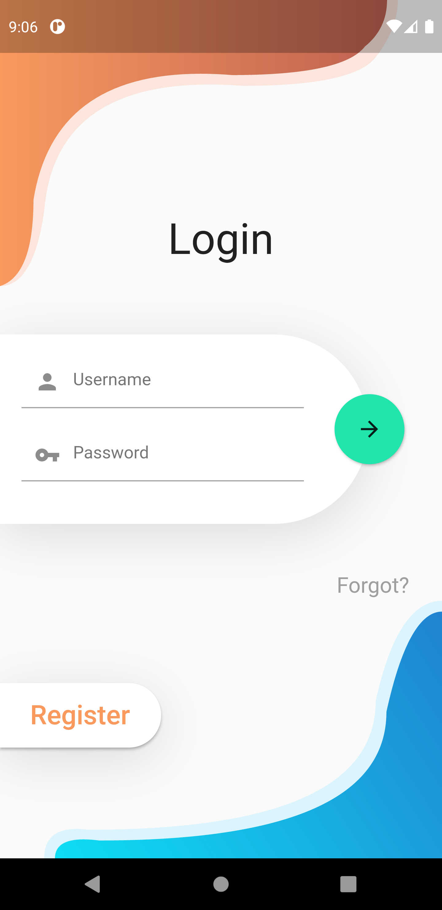
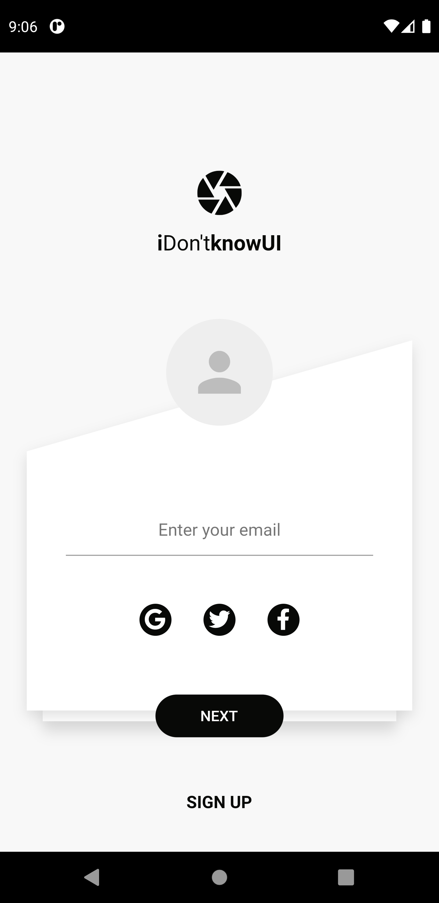
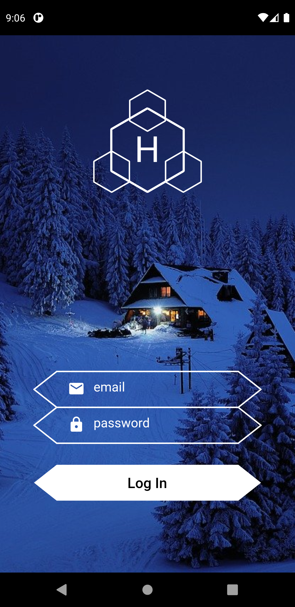
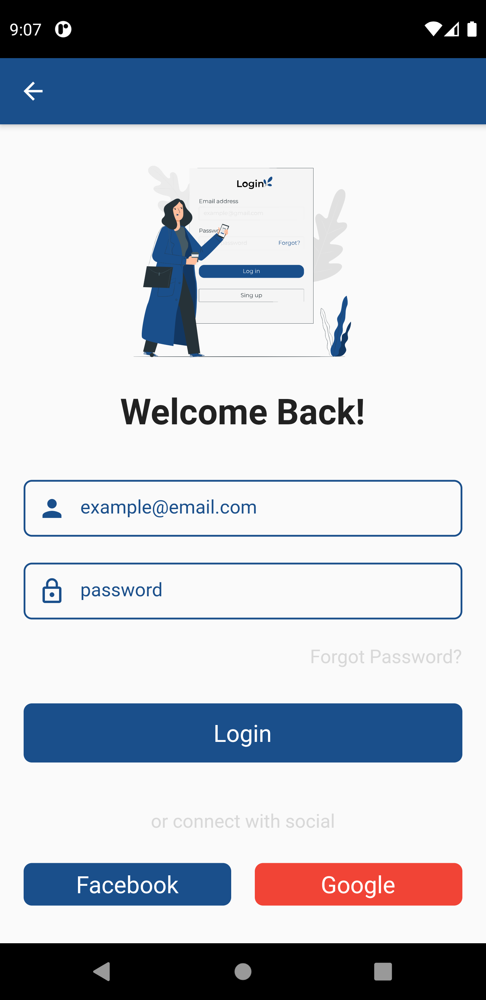
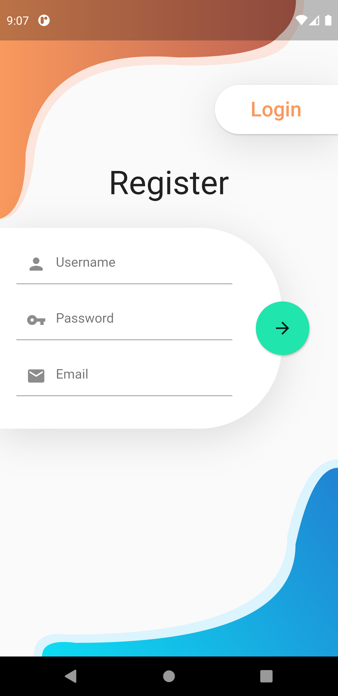
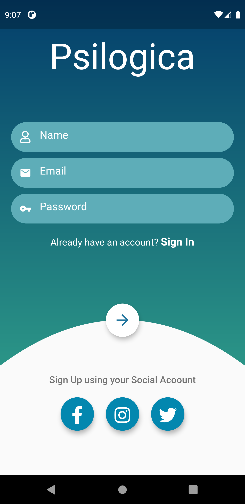
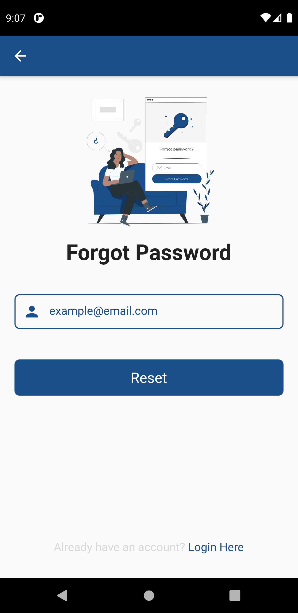

 
 
Home Pages:
 

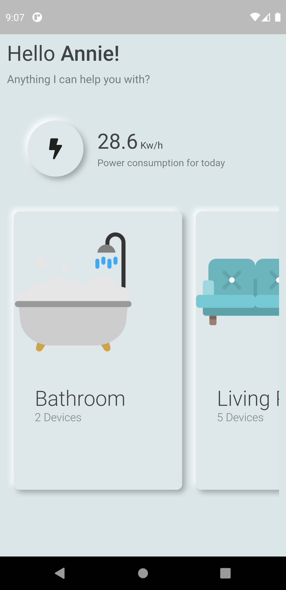
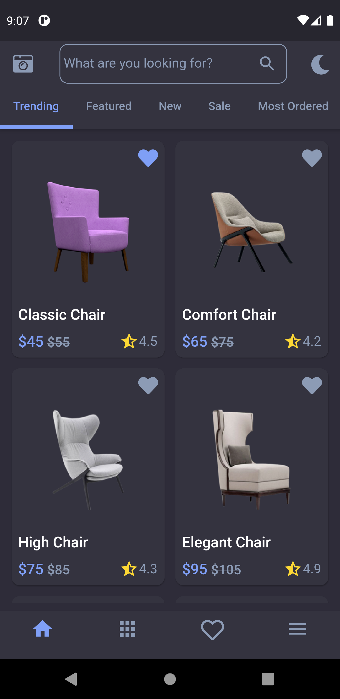
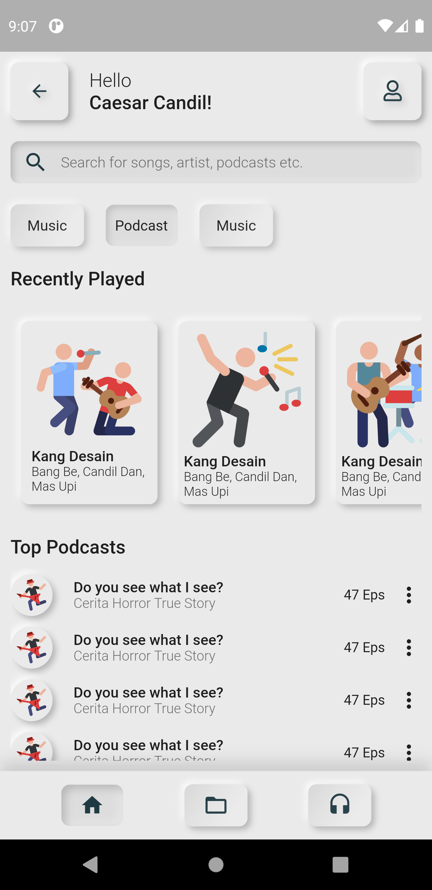

 
 
Detail Pages:
 

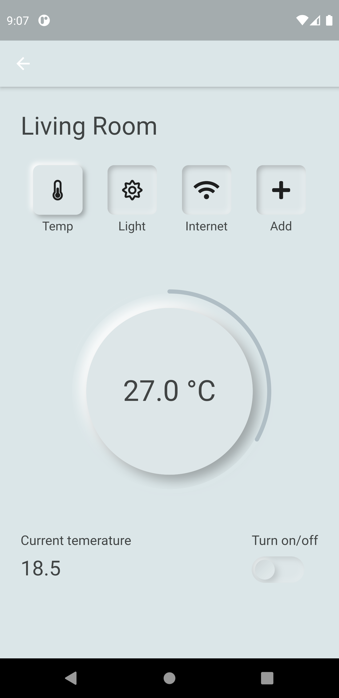
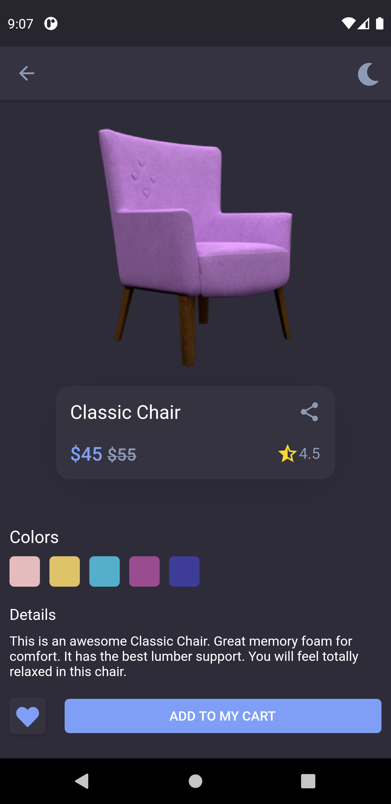
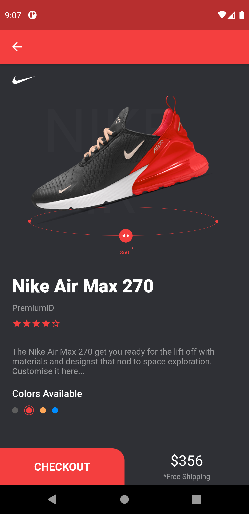
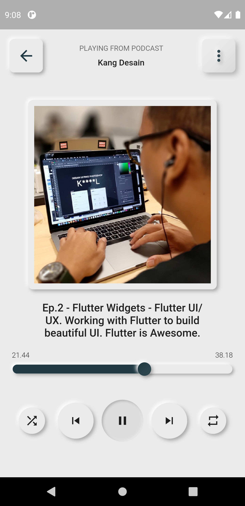

